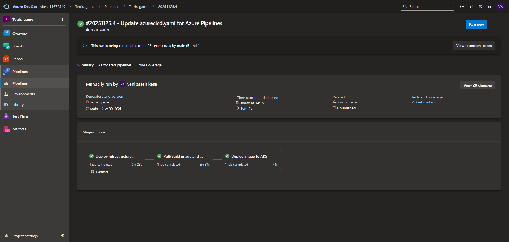
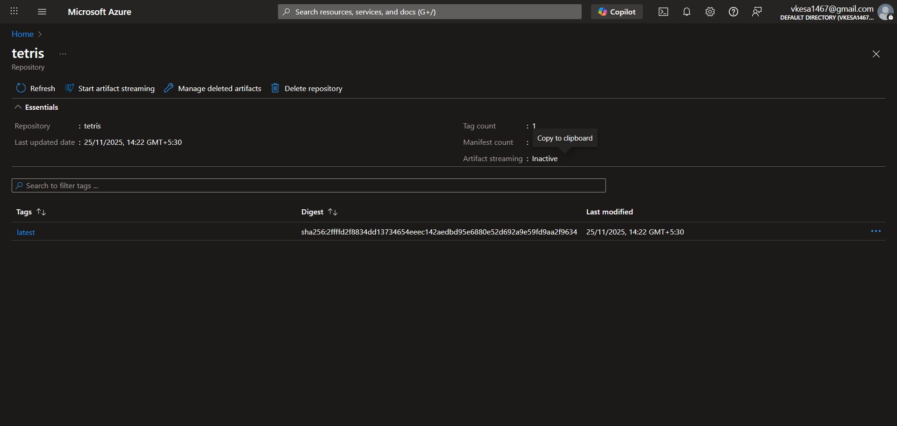
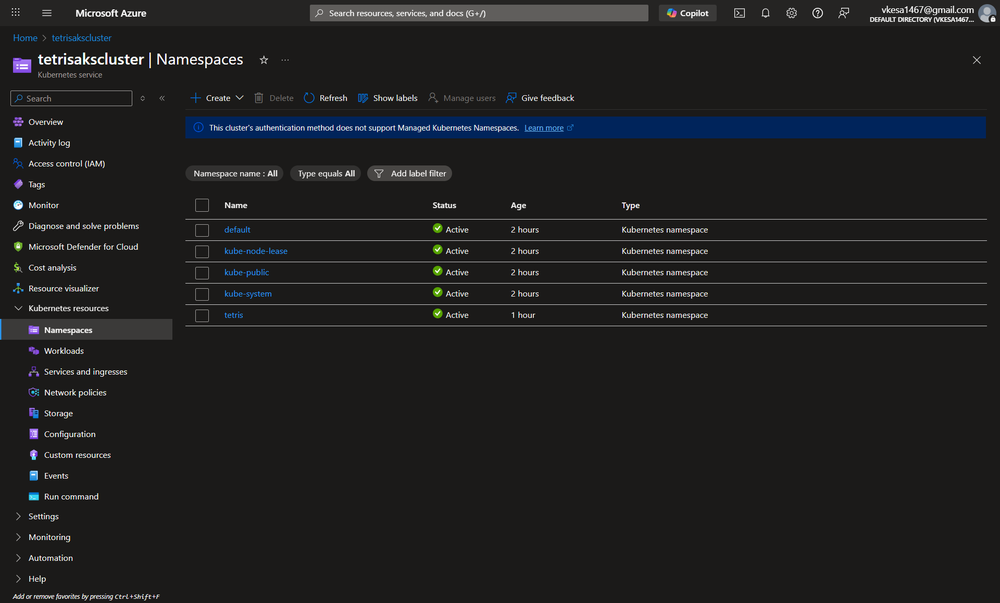
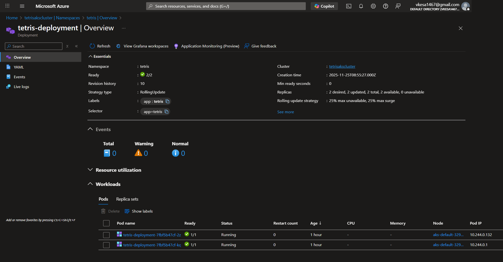
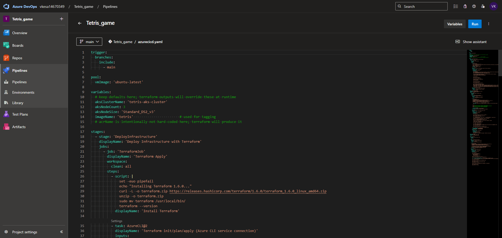
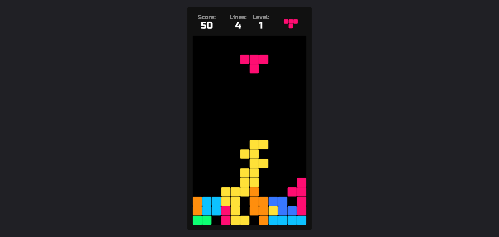

Successfully Built & Deployed an End-to-End Azure DevOps CI/CD Pipeline to AKS!

Over the past few days, I completed a hands-on DevOps project where I built a fully automated CI/CD pipeline using:

✔ Azure DevOps
✔ Azure Kubernetes Service (AKS)
✔ Azure Container Registry (ACR)
✔ Docker
✔ Azure CLI
✔ Workload Identity Federation (OIDC)
✔ Kubernetes (kubectl)

This project was built from scratch and required both cloud engineering and DevOps troubleshooting.

🔧 Technologies Used

Azure DevOps Pipelines (YAML)

Azure Kubernetes Service (AKS)

ACR + Docker Images.

Workload Identity Federation (no secrets!)

Azure CLI automation

Kubernetes deployments

🧩 What I Implemented

Created Azure DevOps Service Connection using OIDC

Built CI pipeline to build & push Docker images to ACR

Created AKS cluster & attached ACR for image pulls

Deployed containerized app to AKS using kubectl

Implemented secure RBAC with Owner/Contributor roles

Automated everything in YAML pipeline

Fixed subscription access errors & AAD role propagation issues

Successfully deployed the app end-to-end

Project Screenshots

📸 Screenshot 1: Azure DevOps Pipeline (CI + CD)

📸 Screenshot 2: ACR Repo with Docker Images

📸 Screenshot 3: AKS Cluster Overview

📸 Screenshot 5: YAML Pipeline Configuration

📸 Screenshot 6: Web Application Running on AKS

🚀 What I Gained

This project strengthened my real-world skills in:

Cloud infrastructure automation

Kubernetes deployments

CI/CD pipeline design

Azure RBAC & security

Troubleshooting Azure CLI + AAD issues

Docker image lifecycle

Cloud DevOps best practices
